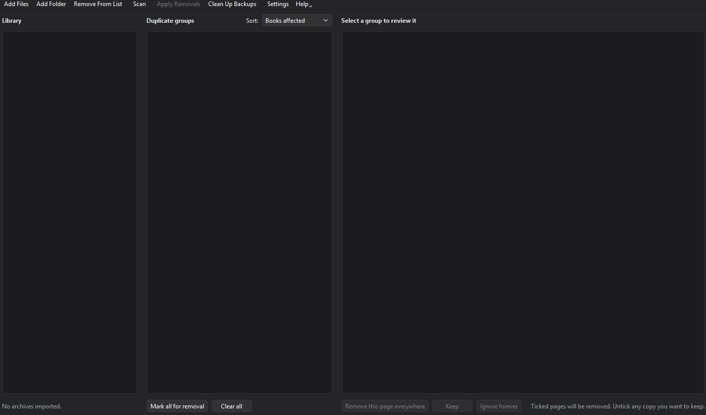

<div align="center">


# Comic Cleaner

**Find and remove duplicate pages across your comic archives.**

Ads, scanlation credits and "read more at…" filler — gone, in bulk, across a whole series.

[](https://github.com/trevoedwards/comic-cleaner/actions/workflows/ci.yml)
[](https://www.python.org/)
[](https://doc.qt.io/qtforpython/)
[](#requirements)
[](https://docs.astral.sh/ruff/)
[](LICENSE)



</div>

---

Comic Cleaner does for a local library what [Komga's duplicate-pages feature](https://komga.org/docs/guides/duplicate-pages/)
does for a server: it hashes every page in every book, finds the images that
keep reappearing, and lets you strip them out — without touching the story.

Import works the way ComicTagger's does. Drag archives or folders in, scan,
review what it found, and apply.

## Contents

- [Why](#why)
- [Features](#features)
- [Requirements](#requirements)
- [Install](#install)
- [Quick start](#quick-start)
- [How matching works](#how-matching-works)
- [Settings reference](#settings-reference)
- [Safety](#safety)
- [Backups](#backups)
- [Building a portable binary](#building-a-portable-binary)
- [When something goes wrong](#when-something-goes-wrong)
- [Development](#development)
- [Project layout](#project-layout)
- [Credits](#credits)

## Why

Scanned and repackaged comics pick up junk. The same advert page gets injected
into all forty issues of a run; a scanlation group staples its credits page onto
every chapter. Individually they are trivial. Across a library they are constant
friction — a page you swipe past hundreds of times.

The giveaway is repetition: a page that appears in *one* book is content, and a
page that appears in *thirty* is almost certainly not. Comic Cleaner ranks
matches by exactly that, so the worst offenders surface first.

## Features

- **Reads what you already have** — `.cbz` / `.zip` natively, plus `.cbr` /
  `.rar` / `.cb7` / `.7z` through 7-Zip, `unrar` or WinRAR if any is installed.
- **Two kinds of matching** — a SHA-256 of the stored bytes finds identical
  copies; a 64-bit perceptual hash finds the same advert re-encoded, rescaled or
  recompressed.
- **Fast on big libraries** — multi-index hashing keeps similarity search near
  linear. 50,000 pages at threshold 6 clusters in ~1.3 s.
- **Review before anything changes** — every match is shown as a thumbnail grid
  with a per-copy tick box, plus a dry-run mode.
- **Cautious writes** — rebuilt archives are verified before the original is
  touched, and `ComicInfo.xml` page counts are kept consistent.
- **Remembers your decisions** — page hashes are cached, and groups you mark
  *Ignore forever* stay hidden across scans.
- **Light, dark or follow-system** theming.

## Requirements

| | |
|---|---|
| **Python** | 3.10 or newer (developed on 3.12) |
| **OS** | Windows, macOS and Linux. All three are built and tested in [CI](.github/workflows/ci.yml). |
| **Optional** | [7-Zip](https://www.7-zip.org/), `unrar` or WinRAR, only for `.cbr` / `.cb7`. Found automatically on `PATH` or in the usual install folders; **Settings → Archive tools** shows what was detected. |

Everything else is three pip packages — PySide6, Pillow and numpy — installed
into a project-local `.venv`. Nothing lands on your system Python.

## Install

```bash
python -m venv .venv
.venv/bin/python -m pip install -e ".[dev]"      # macOS, Linux
```

```powershell
py -3.12 -m venv .venv
.\.venv\Scripts\python.exe -m pip install -e ".[dev]"
```

Or grab a prebuilt binary and skip all of the above — see
[Building a portable binary](#building-a-portable-binary).

## Quick start

```bash
python -m comiccleaner
```

Optionally pass paths to import on launch:

```bash
python -m comiccleaner "/path/to/comics"
```

Then:

1. **Import** — drag archives or folders onto the window, or use *Add Files* /
   *Add Folder*. Folders are searched recursively.
2. **Scan** — every page is decoded and hashed. Results are cached against each
   file's size and modification time, so re-scanning an unchanged library is
   instant.
3. **Review** — the middle column lists duplicate groups, ranked by how many
   books they affect. Select one to see every copy. All copies are ticked for
   removal by default; untick any you want to keep.
4. **Decide** — *Remove this page everywhere*, *Keep*, or *Ignore forever*.
5. **Apply** — a confirmation dialog spells out exactly what will change, with a
   dry-run option that reports without touching anything.

> [!TIP]
> Changing any matching setting re-groups instantly — it does not re-scan.
> Slide the similarity threshold around and watch the groups reshape.

## How matching works

Each page gets two fingerprints:

| Signal | What it catches | Shown as |
|---|---|---|
| SHA-256 of the stored bytes | Byte-identical copies | **identical** |
| 64-bit difference hash (dHash) | The same image re-encoded, rescaled or recoloured | **similar** |

The perceptual hash compares each pixel to its right-hand neighbour, which makes
it invariant to scaling and to overall brightness shifts — exactly what happens
when an advert is re-compressed on its way through three repackagings.

Above a few thousand pages, similarity search switches to **multi-index
hashing**: each hash is split into `threshold + 1` disjoint bands, and by the
pigeonhole principle any two hashes within the threshold must share at least one
band exactly. Comparing only within band buckets skips almost all of the n²
pairs. This is an exact speed-up, not an approximation — the test suite asserts
it produces identical clusters to brute force.

> [!NOTE]
> Clustering is single-linkage, so if A matches B and B matches C, all three land
> in one group even when A and C differ by more than the threshold. That is why
> the threshold defaults to 0 and why loose values need a look before you bulk
> delete.

## Settings reference

| Setting | Default | Notes |
|---|---|---|
| **Theme** | Follow system | Light, dark, or the OS setting. Previews live as you change it. |
| **Similarity** | 0 | Hamming distance on the perceptual hash. `0` = identical images only. `2`–`6` catches re-encodes. Above ~`10`, expect false matches. |
| **Minimum copies** | 2 | How many occurrences before a group is shown. |
| **Across at least (books)** | 2 | Ads repeat across books. Raise to cut noise; set to `1` to catch a page repeated inside a single book. |
| **Never match the first page** | on | Protects covers, which legitimately repeat across a series. |
| **Never match the last page** | off | The back-cover equivalent. |
| **Include blank pages** | off | Blank and solid-colour pages look alike to *any* perceptual hash, so they are hidden unless asked for. |
| **Back up the original** | on | See [Safety](#safety). |
| **Delete backups after a run** | off | Sweeps the `.bak` files once every archive in the run has succeeded. |
| **Write cleaned copies to** | *(in place)* | Point at a folder to leave your originals completely untouched. |

## Safety

Removal is the only destructive operation, and it is deliberately paranoid:

- The rebuilt archive is written to a temp file and **verified** — it must open
  cleanly and contain exactly the expected page count — *before* the original is
  touched.
- The original is then moved aside with an atomic rename and the new file
  swapped in. If anything fails, the original is put back.
- It **refuses to remove every page** from an archive.
- It **refuses to act on a stale plan**: if an archive changed on disk since the
  scan, it is skipped rather than mangled.
- If a file is locked by another program, the swap is abandoned and the app says
  so, leaving that archive alone.

> [!WARNING]
> `.cbr` and `.cb7` cannot be written to — the formats are read-only in every
> free tool. Removing pages from one produces a **`.cbz` next to it**, with the
> original kept as the backup.

Back up anything irreplaceable before a large run, and try the dry-run first.

## Backups

By default a run leaves a `.bak` beside every archive it touched. Three ways to
deal with them:

- The **removal-finished dialog** shows how much space they use and offers a
  one-click *Delete N backup(s)*.
- **Clean Up Backups…** on the toolbar sweeps backups left by earlier runs.
- **Settings → Delete the backups once the whole run has succeeded** does it
  automatically. Backups still protect each rewrite while it happens; they are
  only removed at the very end, and only if *nothing* in the run failed.

You can also point **Settings → Backup folder** somewhere else to keep them out
of your comics directory entirely.

## Building a portable binary

One script covers all three platforms:

```bash
python build.py --clean --smoke-test
```

Thin wrappers exist for convenience — `build.ps1` on Windows, `build.sh` on
macOS and Linux — forwarding the same options:

| Option | Effect |
|---|---|
| `--onedir` | Emit a folder instead of one file. Starts faster, easier to debug. |
| `--console` | Keep the console so tracebacks are visible. |
| `--clean` | Wipe `build/` and `dist/` first. |
| `--smoke-test` | Launch the result and fail on an early exit or any traceback. |

What you get:

| Platform | Output | Icon |
|---|---|---|
| Windows | `dist/ComicCleaner.exe` | embedded `.ico` |
| macOS | `dist/ComicCleaner.app` | embedded `.icns` |
| Linux | `dist/ComicCleaner` | from the bundled PNG at runtime |

> [!NOTE]
> PyInstaller **cannot cross-compile** — each binary has to be built on the OS
> it targets. CI does all three on every push and uploads them as artifacts. A
> packaged build still needs 7-Zip or `unrar` on the target machine for `.cbr` /
> `.cb7`; `.cbz` works standalone.

## When something goes wrong

If the app hits an unhandled error it writes a full report to a **`crashlog`
folder beside wherever it was launched from**, then tells you where it went.
Each report carries the traceback, the app and Qt versions, the platform, which
archive tools were detected, and the last couple of hundred log lines leading up
to the failure — enough to act on without needing to reproduce it.

If the launch folder is read-only (a binary in `Program Files` or `/usr/bin`),
the report falls back to the app's data directory rather than being lost.
`--self-test` prints the location either way.

Crashes on background scan and removal threads are recorded too, which they
would not be otherwise — a thread that dies takes its traceback with it.

## Development

```bash
python -m pytest        # core + offscreen GUI tests
python -m ruff check .
```

The GUI tests drive the real window through Qt's `offscreen` platform, so the
whole suite runs without a display.

To check a *packaged* build without a display:

```bash
./dist/ComicCleaner --self-test "/path/to/comics"
```

It reports the archive tools found, whether the icon was bundled, which Pillow
codecs survived packaging, and what a real scan produced. Windowed builds have
no console, so it writes `comiccleaner-selftest.txt` next to wherever you ran
it. This catches the packaging failures that are otherwise silent — a missing
JPEG codec would make every scan quietly find nothing.

## Project layout

```
src/comiccleaner/
├── assets/          app icon, bundled into the build
├── resources.py     asset lookup that also works inside a PyInstaller bundle
├── core/            no Qt imports — fully testable headless
│   ├── archive.py     read cbz/cbr/cb7, write cbz
│   ├── extern.py      locate and drive 7-Zip / unrar
│   ├── hashing.py     content SHA + perceptual dHash
│   ├── scanner.py     walk archives and hash pages, in parallel
│   ├── cache.py       SQLite hash cache and ignore list
│   ├── grouping.py    cluster pages into duplicate groups
│   ├── remover.py     verified, backed-up archive rewriting
│   └── comicinfo.py   keep ComicInfo.xml consistent
└── gui/             PySide6 layer
    ├── main_window.py three aligned columns: library, groups, page grid
    ├── theme.py       light / dark / follow-system palettes
    ├── settings.py    preferences and the settings dialog
    ├── thumbs.py      lazy, cached thumbnail loading
    ├── workers.py     background scan and removal threads
    └── about.py       About dialog
```

`core` never imports Qt, so the entire scan → match → remove pipeline can be
used as a library or driven from a script.

## Credits

Developed by **Trevor Edwards** — [Playback Software](https://git.playbacksoftware.com/).

Inspired by [Komga](https://komga.org/)'s duplicate-pages feature and
[ComicTagger](https://github.com/comictagger/comictagger)'s import workflow.

Licensed under the [MIT License](LICENSE).
