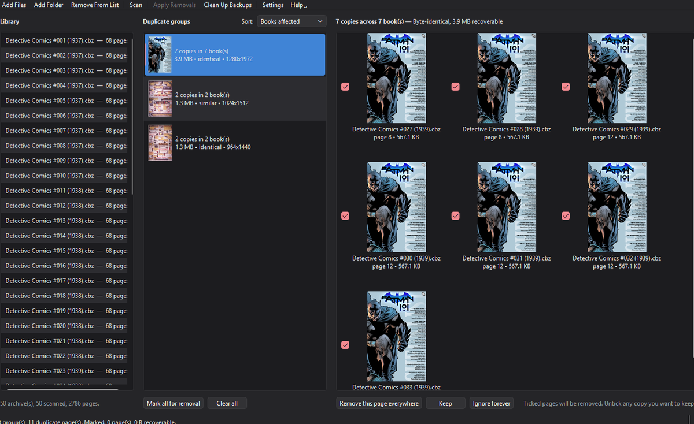
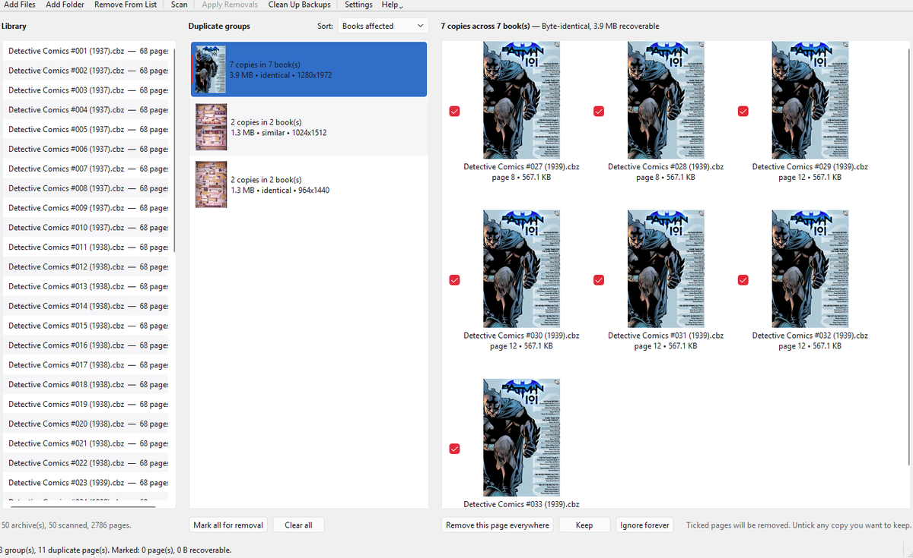

<div align="center">


# Comic Cleaner

**Find and remove duplicate pages across your comic archives.**

Ads, scanlation credits and "read more at…" filler — gone, in bulk, across a whole series.

[](https://github.com/trevoedwards/comic-cleaner/actions/workflows/ci.yml)
[](https://www.python.org/)
[](https://doc.qt.io/qtforpython/)
[](#requirements)
[](https://docs.astral.sh/ruff/)
[](LICENSE)

</div>

| Dark | Light |
|:---:|:---:|
|  |  |

Repackaged comics pick up junk — the same advert injected into all forty issues
of a run, a credits page stapled onto every chapter. The giveaway is repetition:
a page in *one* book is content, a page in *thirty* almost certainly is not.

Comic Cleaner hashes every page, groups the images that keep reappearing, ranks
them by how many books they affect, and strips out the ones you confirm — across
a whole library at once, without unpacking anything by hand.

## Requirements

- **Python 3.10+** (developed on 3.12), or just grab a [prebuilt binary](#building-a-binary).
- **Optional:** [7-Zip](https://www.7-zip.org/), `unrar` or WinRAR — only for
  `.cbr` / `.cb7`. Found automatically; **Settings → Archive tools** shows what
  was detected. `.cbz` needs nothing. To use a specific 7-Zip, set
  `COMICCLEANER_7Z` to its path.

Everything else is three pip packages (PySide6, Pillow, numpy) in a
project-local `.venv`. Nothing lands on your system Python.

## Install and run

```bash
python -m venv .venv
.venv/bin/python -m pip install -e ".[dev]"     # .venv\Scripts\python.exe on Windows
python -m comiccleaner "/path/to/comics"        # paths are optional
```

1. **Import** — drag archives or folders in, or use *Add Files* / *Add Folder*.
2. **Scan** — pages are decoded and hashed, then cached against each file's size
   and mtime, so re-scanning an unchanged library is instant.
3. **Review** — groups are ranked by how many books they affect. All copies are
   ticked for removal; untick any you want to keep.
4. **Apply** — a confirmation dialog spells out every change, with a dry run.

> [!TIP]
> Changing a matching setting re-groups instantly — it does not re-scan.

## How matching works

| Signal | Catches | Shown as |
|---|---|---|
| SHA-256 of the stored bytes | Byte-identical copies | **identical** |
| 64-bit difference hash | The same image re-encoded, rescaled or recoloured | **similar** |

The perceptual hash compares each pixel to its right-hand neighbour, so it
survives the rescaling and recompression an advert picks up on its way through
three repackagings.

Past a few thousand pages, similarity search switches to **multi-index
hashing** — each hash is split into `threshold + 1` bands, and by the pigeonhole
principle any true match must share a band exactly, so only band buckets get
compared. It is an exact speed-up, not an approximation, and the tests assert it
matches brute force. 50,000 pages at threshold 6: ~1.3 s instead of ~102 s.

> [!NOTE]
> Clustering is single-linkage — if A matches B and B matches C, all three group
> together even when A and C are further apart than the threshold. Hence the
> default of 0, and why loose values deserve a look before you bulk delete.

## Settings

| Setting | Default | Notes |
|---|---|---|
| **Theme** | Follow system | Light, dark or the OS setting, previewed live. |
| **Similarity** | 0 | Hamming distance. `0` = identical only, `2`–`6` catches re-encodes, above ~`10` expect false matches. |
| **Minimum copies** | 2 | Occurrences before a group is shown. |
| **Across at least (books)** | 2 | Ads repeat across books. `1` also catches a page repeated within one book. |
| **Never match first / last page** | on / off | Protects covers, which legitimately repeat across a series. |
| **Include blank pages** | off | Blank pages look alike to *any* perceptual hash. |
| **Delete backups after a run** | off | Sweeps `.bak` files once every archive in the run has succeeded. |
| **Write cleaned copies to** | *(in place)* | Point at a folder to leave originals untouched. Books keep their folder layout underneath it, and an existing file is never overwritten. |

## Safety

Removal is the only destructive operation, and it is deliberately paranoid:

- The rebuilt archive is written to a temp file and **verified** — opens cleanly,
  correct page count — *before* the original is touched.
- The original is then moved aside atomically and the new file swapped in. On any
  failure the original is put back.
- It refuses to empty an archive. Every page marked for removal is re-checked
  against its hash from the scan, so a book that was re-packed or reordered since
  is left alone rather than losing the wrong page.
- A file locked by another program is skipped with an explanation, not mangled.
- `ComicInfo.xml` is kept in step: `PageCount` is updated, and each `Page` entry's
  `Image` index is shifted so it still points at the same image.

Backups are kept by default. Clear them from the removal-finished dialog, from
**Clean Up Backups…** on the toolbar, automatically via Settings, or keep them
out of the way entirely with a backup folder.

> [!WARNING]
> `.cbr` and `.cb7` cannot be written to. Removing pages from one produces a
> **`.cbz` beside it**, with the original kept as the backup.

Back up anything irreplaceable before a large run, and try the dry run first.

## Building a binary

```bash
python build.py --clean --smoke-test
```

Options: `--onedir`, `--console`, `--clean`, `--smoke-test`, and `--smoke-only`
(re-test whatever is already in `dist/` without rebuilding). It runs the same on
Windows, macOS and Linux, and uses the project `.venv` if there is one.

| Platform | Output | Icon |
|---|---|---|
| Windows | `dist/ComicCleaner.exe` | embedded `.ico` |
| macOS | `dist/ComicCleaner.app` | embedded `.icns` |
| Linux | `dist/ComicCleaner` | bundled PNG at runtime |

> [!NOTE]
> PyInstaller cannot cross-compile — each binary must be built on the OS it
> targets. CI builds all three on every push and uploads them as artifacts.

## When something goes wrong

Unhandled errors are written to a **`crashlog` folder beside wherever the app was
launched from**, and the app tells you the path. Each report has the traceback,
versions, platform, detected archive tools, and the last couple of hundred log
lines. Background scan and removal threads are covered too. If the launch folder
is read-only the report falls back to the app data directory rather than being
lost.

## Development

```bash
python -m pytest          # core + offscreen GUI tests
python -m ruff check .
```

GUI tests drive the real window through Qt's `offscreen` platform, so the suite
runs without a display. To check a *packaged* build:

```bash
./dist/ComicCleaner --self-test "/path/to/comics"
```

It reports the archive tools found, whether the icon was bundled, which Pillow
codecs survived packaging, and what a real scan produced — catching the silent
packaging failures, like a missing JPEG codec that would make every scan quietly
find nothing.

`src/comiccleaner/core/` never imports Qt, so the whole scan → match → remove
pipeline works as a library; `gui/` is the PySide6 layer on top.

## Credits

Developed by **Trevor Edwards** — [Playback Software](https://playbacksoftware.com/).

Licensed under the [MIT License](LICENSE).
